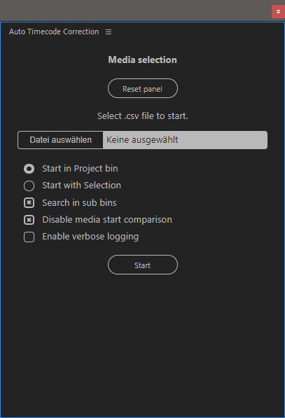
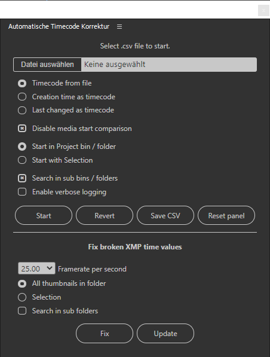
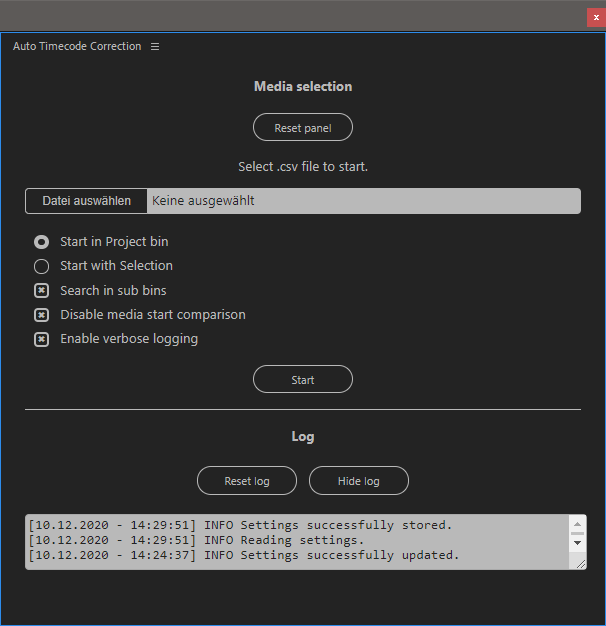

# Automated Timecode Update for Adobe Premiere Pro  14.5+ (CC 2020) and Bridge 10.0+ (CC 2020)

*Made for .csv files exported by [Tentacle Timecode Tool 1.16](https://tentaclesync.com/timecode-tool).*

## Automated processing
This CEP HTML plugin changes start times of media files (can be any, except sequences) in a Premiere Pro project. 

**Important: Media files are not changed. Only XMP Metadata is updated. Use at your own risk.**

There is no guarantee every editing software is capable of interpreting Adobe XMP metadata.




*Panel in Premiere Pro vs Bridge*


## Why would you need that?

This plugin offers following benefits:

- **Fast** - it is multiple times faster then baking the timecode with a conversion or manual timecode updates
- **Flexible** - modifying the .csv file in your spreadsheet app of choice offers to possibility to fix timecode drift or add missing timecode if a conversion should have failed. (Out of the box Premiere offers nothing comparable besides changing every file one by one.)
- **Non destructive** - original start time / time code will not be overwritten
- **Framerating mixing** - automatically converts different timebases (e.g. from a 25 fps source to a 30 fps file).
 
## Requirements

Your Premiere Pro has to at least support Adobe CEP plugins.

Tested with:

- Premiere pro 14.7 (CC 2020)
- Premiere Pro 14.5 (CC 2020)
- Bridge 12.0.0.234 (CC 2022)
- Bridge 13.0.0.562 (CC 2023)

## Differences between Premiere and Bridge

### Premiere Pro

This version works as the previous update. In further testing it turned out, that Premiere doesn't change metadata permanently. You loose the changes if the files are relinked.

Thus the scope was widened to solve the problem in Bridge. 

### Bridge

Works similarly to the Premiere version. 

They share the same panel, but certain features are deactivated for Premiere

This plugin changes permanently changes the file meta data.

#### Additional Features

- Export timecode stored in metadata to csv
- Revert changed timecodes to previous values
- Fix broken timecodes (fixes a problem that happens when timecodes are added in Premiere Pro)

## Installation

### Future

This app will be available in Adobe Exchange (also accessible through Creative Cloud Experience PlugIns).
### Manual installation
See also [PProPanel Docs](https://github.com/Adobe-CEP/Samples/tree/master/PProPanel).

Put the plugin folder into these directiories, to have Premiere Pro load it:

```html
Windows:    C:\Program Files (x86)\Common Files\Adobe\CEP\extensions
Mac:        /Library/Application Support/Adobe/CEP/extensions
```

### Debug Mode
If you try to run a non signed instance you have to enable ```PlayerDebugMode```.

On Mac, type the following into Terminal, then relaunch Finder (either via
rebooting, or from the Force Quit dialog):

```html
defaults write /Users/<username>/Library/Preferences/com.adobe.CSXS.10.plist PlayerDebugMode 1
```

On Windows, make the following registry entry (a new Key, of type String):


## Options


After selecting your file, you can select following options to discover the media files you need:

- **Start with project bin / selection** 
    
    These radio buttons decide whether your selection or the project root / bin are the starting base to search for clips.

- **Search in sub bins**

    Enabling this option will make the program "open" every folder it discovers. Should be used in caution in combination with selections. Repeating matches will be disgarded, but it might take longer. 

- **Disable media start comparison**

    Enabling this option will disable the comparing of the file timecode parsed from the .csv and the media start time of the clip. It will then only compare the file name and duration, which in an off change lead to false matches.

    This can be used to correct mistakes or bulk revert changes (with swapped .csv columns).

- **Enable verbose logging**

    Enabling this option will show an extensive log of what is happening in the plugin. Errors contained in the .csv will show up no matter the settings.

    #### Logging levels
   - **CRIT** - plugin errors (e.g. settings invalid etc.)
   - **ERR** - mistakes in the .csv  
   - **INFO** - normal program routines
   - **STAT** - errors that disrupted the process



**These settings will not be stored between program updates!**

### .CSV content / Manual input

If a .csv spreadsheet is created without the tentacle timecode tool, it has to contain "File Name", "Duration", "File TC", "Audio TC" and "Framerate" in this order.

| File Name | Duration | File TC | Audio TC | Framerate
|-----------|----------|---------|----------|-----------
|Test | 00:00:05 | 15:23:10:20| 15:23:08:20 | 25.00

The .csv string is as following:

```csv
File Name,Duration,File TC,Audio TC,Framerate
"TestName.MOV","00:00:05","15:21:06:07","08:22:12:18","25.00"
```


Tentacle Timecode Tool only stores hh:mm:ss for durations, but frames can be inserted in this section. The match will work anyways.

## Safety

It was important for me to get a quick overview on mistakes that might have come up during import, so one can fix it easily. Especially for the more critical process of settings timecodes, where finding mistakes can take a long time. For this reason a log area is implement, which shows errors or a verbose process status.

If an error in the csv is discovered at the parsing stage, it will push a log message inside the gui with the cause of failure.

The process will stop if the file is not a .csv, header information of the .csv is incomplete, the rows are missing columns etc. . 

Parsing single rows will give a warning for every file that couldn't be processed.

At the end every successful change will be logged only if verbose logging is enabled.

### Known Issues

- **High Framerate Files don't match**
File duration is used to pick the correct files. Tentacle only outputs duration down to the second. Which can lead to rounding errors in combination with highframerate footage. In this case the duration in the .csv should be rounded down.

- **WAV Files don't update their metadata**
The metadata is always changed by the plugin. For an yet unknown reason Bridge doesn't retain the changed metadata, even after the new one was provided.
Currently Metadata of wav files can be changed after a restart of Bridge.
## Version history

### Current
in progess

### Previous

| Version    | Date      | Description
|---------   |------     |------------
| 0.2.2      | 13.11.2022 | Adds csv export of metadata, small fixes, updated style
| 0.2.1      | 10.01.2022 | Rewrite of the extension to be compatible with Bridge
| 0.2.0      | 15.01.2021 | Adds bridge as a plugin host
| 0.1.1      | 05.01.2021 | Mid-test, small fixes (time in ticks, matching of files)
| 0.1.0      | 11.12.2020 | Pre-test, non-compiled, but optically finished build
| 0.0.0      | 25.11.2020 | Development start
- - -

### Changelist
- 0.2.2 <-> 13.11.2022
    - Timecode metadata can now be exported to csv (Bridge only)
    - Timecode related metadata in audio files is handled better (Bridge only)
    - Missing timecodes are no longer "undefined" -> 00:00:00:00 (Bridge only)
    - Paneltext can't be accidentally selected anymore
    - Selection and root start was switched (Bridge only)
    - CSS tweaks

- 0.2.1 <-> 10.01.2022

    - Add Bridge as extension host
    - Rewrite the pipeline to update timecodes using thumbnail metadata
    - Add fix for broken xmp metadata (from manual update - Bridge only)
    - Revert feature (Bridge only)
    - Ability to create timecode from file creation date (Bridge only)

- 0.1.0 <-> 11.12.2020

   - Pretesting stage (not tested with a production Premiere Pro Project)
   - CSS design is basically finished
   - Severe bugs have been caught

- 0.0.0 <-> 25.11.2020
    
    -Development start


## Maintenance

This plugin will not be thoroughly maintained. If any bugs occur, it might take a while for them to be fixed. It is just a side project of myself.


## Compiling / running the source code

Running the plugin via the source code requires the setting up [Premiere Pro for Developement](https://github.com/Adobe-CEP/Samples/tree/master/PProPanel).

Further informations for creating a package out of changed source code can be found under this link as well.

The debugging port for the HTML of this panel is configured at port **7780**.
```html
http://localhost:7780/
```

## Future

This is considered not feature complete yet. 

After Bridge is feature complete, then there will only be bug fixes and maintence, since this is just a side project. 

If the plugin breaks on newer Premiere versions it will eventually be updated.


## Reason

I film with DSLRs cameras providing interal timecode, but not taking external sources. So it is hard to synchronize those files using the benefits of timecode. Thus I record audio timecode via a Tentactle Sync E s. 

These audio timecode need to be read by a tool like the Tentacle Timecode Tool and can then be converted to a new media file with the correct time code. Since this takes up a considerable amount of CPU-Time, I have opted to painstackenly update the timecodes by hand. Since this takes up 30 min to several hours per project anyways, I wanted to automate the direct update of the media metadata. It now does work in a few milliseconds to seconds instead of hours. 

This could have been implemented as a macro as well. Implementing error detection / correction would have needed extensive programming anywways. 

So I opted for making a CEP plugin which integrates seemlessly into Premiere. I wanted an "easier" scope to test CEP plugin development for Premiere, to have a better idea creating future  plugins.