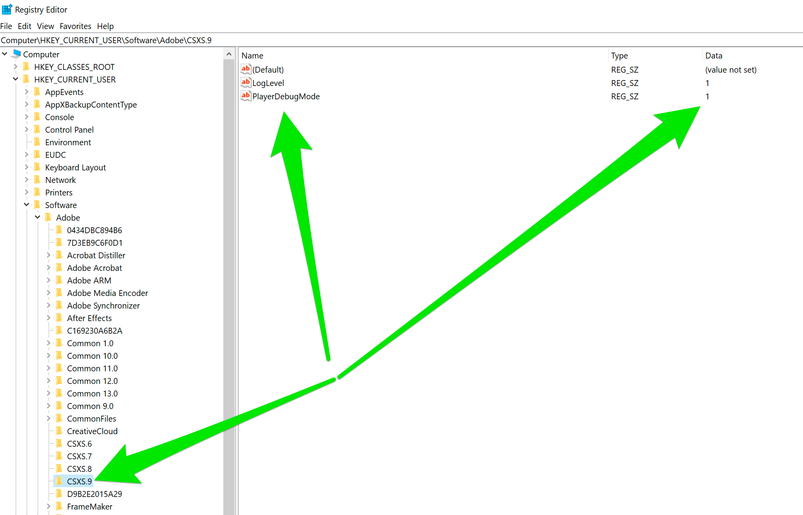
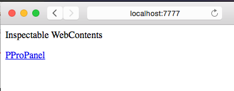
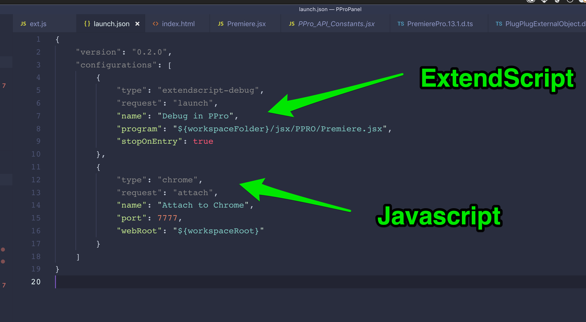

# Automated Timecode Update for Adobe Premiere 14.5+ (CC 2020)

*Made for .csv files outputed by the Tentacle Timecode Tool 1.16.*

## Automated processing
This CEP HTML plugin changes start times of media files (can be any, except sequences) in a project. 

**Important: Media files are not changed. Only XMP Metadata is updated.**

There is no guarantee every editing software is capable of interpreting Adobe XMP metadata.

### Options


### Safety

It was important for me to get a quick overview on mistakes that might have come up during import, so one can fix it easily. Especially for the more critical process of settings timecodes, where finding mistakes can take a long time. For this reason a log area is implement, which shows errors or a verbose process status.

If an error in the csv is discovered at the parsing stage, it will push a log message inside the gui with the cause of failure.

The process will stop if the file is not a .csv, header information of the .csv is incomplete, the rows are missing columns etc. . 

Parsing single rows will give a warning for every file that couldn't be processed.

At the end every successful change will be logged only if verbose logging is enabled.
- - -
## Version history

### Current

### Previous

| Version   | Date      | Description
|---------  |------     |------------
| 0.10      | 10.12.2020 | Pre-test, non-compiled, but optically finished build
| 0.00      | 25.11.2020 | Development start
- - -

## Maintenance

This plugin will not be thoroughly maintained. If any bugs occur, it might take a while for them to be fixed. It is just a side project of myself.

---

## Compiling / running the source code

---

## License


### 1. Obtain and install these

- [Creative Cloud](http://creative.adobe.com). Use the Creative Cloud
    application to install Premiere Pro CC and other Adobe applications with
    which you'll be developing and testing, as well as ExtendScript Toolkit
    (available under 'previous versions').

- The [CEP Test
    Panel](https://github.com/Adobe-CEP/CEP-Resources/tree/master/CEP_10.x/Samples/CEP_HTML_Test_Extension-10.0)
    shows the full capabilities of CEP panels.

- The [PProPanel](https://github.com/Adobe-CEP/Samples/tree/master/PProPanel)
    sample project is exhaustive in its exercise of Premiere Pro's ExtendScript
    API. If you're reading this, you likely already _have_ the PProPanel sample.

- The
    [ZXPSignCmd](https://github.com/Adobe-CEP/CEP-Resources/tree/master/ZXPSignCMD/4.0.7)
    signing utility creates signed .zxp bundles for Add-Ons or direct
    distribution.
- Microsoft Visual Studio Code, and the ExtendScript debugging extension. This extension running in VSCode is Adobe's recommended ExtendScript development environment. Sorry, ExtendScript Toolkit; you had a good long run.

- Use the [ExManCmd](https://www.adobeexchange.com/resources/28) command line
    utility to test .zxp installation.

### 2. Enable loading of unsigned panels

Further [relevant information](https://medium.com/adobetech/how-to-create-your-first-adobe-panel-in-6-easy-steps-f8bd4ed5778) is available from the Extensibility team.

*Note: Premiere Pro 14.4 integrates CEP10, so even if you had unsigned panels
loading before (using CEP8 or CEP9), you'll need to perform this step again, but for key CSXS.10.*

On Mac, type the following into Terminal, then relaunch Finder (either via
rebooting, or from the Force Quit dialog):

```html
defaults write /Users/<username>/Library/Preferences/com.adobe.CSXS.10.plist PlayerDebugMode 1
```

On Windows, make the following registry entry (a new Key, of type String):



### 3. Put panel into extensions directory

Put `/PProPanel` or your own panel's containing directory here, to have Premiere
Pro load it:

```html
Windows:    C:\Program Files (x86)\Common Files\Adobe\CEP\extensions
Mac:        /Library/Application Support/Adobe/CEP/extensions
```

### 4. Write and test your panel's JavaScript using a JavaScript debugger

To enable debugging of panels using Chrome’s developer tools, put a file named
`.debug` into your extension’s folder (as a peer of the `/CSXS` folder). The
contents of the file should resemble the following (and the Extension ID must
match the one in the panel's manifest):

```xml
<?xml version="1.0" encoding="UTF-8"?>
<ExtensionList>
    <Extension Id="com.example.PProPanel">
        <HostList>
            <Host Name="PPRO" Port="7777"/>
        </HostList>
    </Extension>
</ExtensionList>
```

When the panel is active, you can debug the panel in Chrome by
browsing to `localhost:7777`, and selecting your panel:



Note: You can also use Microsoft Visual Studio Code to debug your panel's JavaScript.

Optional diagnostics: Turn on CEP logging. Find CEP logs (distinct from Premiere
Pro's logs) here. Note that Mac Library path is the system's library, not the
user's. Also, note that logging WILL impact performance.

```html
Windows:    %\AppData\Local\Temp\csxs9-PPRO.log
Mac:        /Library/Logs/CSXS/csxs9-PPRO.log
```

Set logging level in Windows Registry (see above), or MacOS X .plist:

```html
defaults write /Users/<username>/Library/Preferences/com.adobe.CSXS.9.plist LogLevel 6
```

## 5. Create your panel's ExtendScript using Microsoft Visual Studio Code

Once you've installed the ExtendScript debugging extension, you can set breakpoints in your ExtendScript code within VSCode. Here's a view of the debug configurations associated with the PProPanel sample, in VSCode:




Here's a [screen video](https://www.dropbox.com/s/sasea78m05nqcyz/MS_Code_Debugging.mp4?dl=1)
showing how to debug panels at both the JavaScript and ExtendScript levels.

## 6. Package and deploy your panel

Further [relevant information](https://github.com/Adobe-CEP/Getting-Started-guides/tree/master/Package%20Distribute%20Install) is available from the Extensibility team.

You can either generate a self-signed certificate (ZXPSignCmd will make them for
you), or get one from a commercial security provider. Here's an example:

```bash
./ZXPSignCmd -selfSignedCert US California Adobe "Bruce Bullis" TotallySecurePassword certificate.p12
```

To sign directory `/PanelDir` with `certificate.p12`, do the following:

```bash
./ZXPSignCmd -sign panelDir/ PanelName.zxp certificate.p12 password -tsa http://timestamp.digicert.com/
```

Submit your panel to the [Adobe Add-Ons
site](https://www.adobeexchange.com/producer) for approval, and distribution.
You can also directly supply the .zxp file enterprise customers, and those who
do not connect their systems to the public internet, for installation using
[ExManCmd](https://www.adobeexchange.com/resources/28), the command line version
of Extension Manager.

If you encounter any issues with the Add-Ons store or ExManCmd, please [contact
the Add-Ons team](mailto:kwak@adobe.com).

